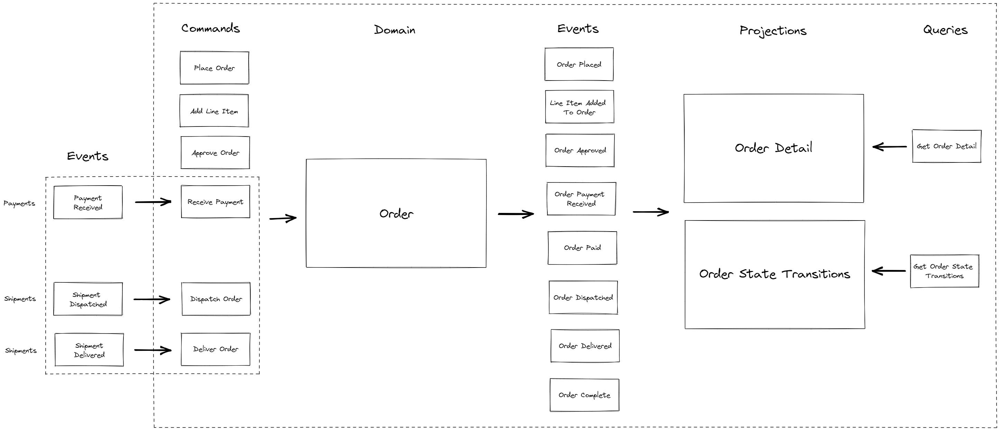

# Orders Event Sourcing Sample

A fictional orders system demonstrating CQRS and Event Sourcing patterns.

This example is to demonstrate the patterns and less about the actual code implementation. i.e., The code is not suitable for production, it's **not** intended to be an example of good coding practices. Implementation in a real world scenario would require more consideration in many areas.

### Dictionary

-   **Commands** - Describes the users intent, i.e., `PlaceOrder`, `ApproveOrder`
-   **Command Handler** - The handler for the command, normally involves loading the domain entity, performing one or more operations, then persisting the updated entity
-   **Aggregate / Domain Model** - Defines a business entity properties and behaviours
-   **Event** - A model representing an event occurred on the domain entity
-   **Event Store** - Persistance for domain events
-   **Event Stream Handler** - Listens for new events added to the event store and publishes them to an event bus
-   **Event Bus** - An event broker for exchanging messages between multiple software components
-   **Event Handler** - Consumes events from the event bus
-   **Projection** - Subscribes to domain events and _projects_ the data into a query model. There can be one or more projections built from an event stream
-   **Query Store** - Persistance for projections
-   **Query Handlers** - The handler for the user query, normally involves reading the projection from the query store
-   **Query** - A query for a projection based on a unique identifier or query

### Notes / Discussion points

-   Domain logic lives in the aggregate / domain model. Don't be tempted to include business logic in projections. Other software components should not have to understand the business rules of the domain events they're consuming
-   Aggregate / domain model is an in memory model. It's purpose is for orchestrating business logic and therefor only includes properties that are required to handle future events
-   There doesn't have to be a one to one relationship between commands and domain events
-   There can be more than one projection for a domain event stream
